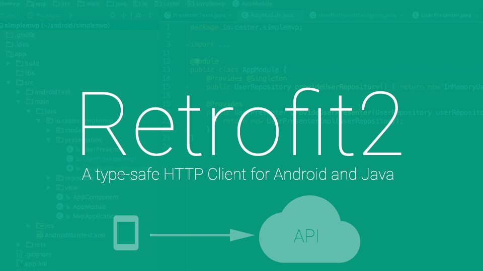

# BGM Share


## 프로젝트 개요

BGM Share 프로젝트는 모바일 앱을 통한 간단한 영상 편집에서 사용할 BGM(Background Music)을 BGM Share를 통해 사용자들끼리 서로 공유할 수 있도록 해주는 간단한 모바일 플랫폼을 만들고자 한다.


프로젝트의 진행 기간은 짧게 3개월이 주어졌기에 최대한 필요한 기능들만 선정해서 넣었다. 기본적으로 제공하는 기능들은 아래와 같다.

* 글쓰기, 수정, 삭제 기능.

* 음악 파일의 업로드 및 다운로드. (글에 같이 첨부하는 형식.)


* 전체 글 확인 피드 & 구독자 글 확인 피드.

 


* 
* 
* 
* 
* 
* 
* 
* 
* 
* 
* 
* 
* 
* 
* 
* 


* 프로필 기능.(프로필 수정, 구독, 사용자 업로드 전체 글)


* 피드의 글 자세히.(댓글 달기, 음악 다운로드, 스트리밍, 저자 프로필 확인, 사용자의 권한에 따른 글 수정, 삭제, 댓글 삭제 기능) 


* 카카오 연동 로그인, 네이버 연동 로그인, 구글 연동 로그인.

 


## 빌드 및 버전

```groovy
comcompileSdkVersion 30
minSdkVersion 22
targetSdkVersion 30
```


## 사용된 기술스택


#### Android Studio


지난번 프로젝트(GFW 실제 앱 이름은 Running Mate 였지만 프로젝트 시작 당시에는 GFW였기에 이렇게 호칭함.)를 진행하면서 Android Studio를 통해 Android Mobile App을 개발하면서 언어로 Java를 사용하였었다. 많은 Legacy가 Java로 작성되어있기에 Java로 개발했었는데 본 프로젝트는 최근의 트랜드인 Kotlin을 사용하여 개발을 진행하였다.


#### Android Jetpack


**Android Jetpack**은 Android Studio에서 개발자들에게 많은 편의 기능을 제공하는 라이브러리로 DataBinding, Navigation, ViewModel,  등과 같은 기능을 제공한다. 본 프로젝트에서는 **DataBinding, Navigation, ViewModel**을 사용하였다.


#### ApolloClient


본 프로젝트의 백엔드에서 음악 파일의 업로드를 제외한 부분의 통신에 GraphQL을 사용하였기에 GraphQL 통신을 도와주는 API인 ApolloClient를 사용하였다. GraphQL을 사용함으로써 REST API의 문제인 언더패칭과 오버패칭의 문제를 해결하고 파일 업로드와 다운로드에서 어려움을 겪는 GraphQL의 문제를 REST API의 부분 수용으로 해결하였다.


#### Retrofit2



REST API 통신 라이브러리인 Retrofit2를 통해서 음악파일의 업로드 및 다운로드 부분을 구현하였다. (Multipart를 사용.)

